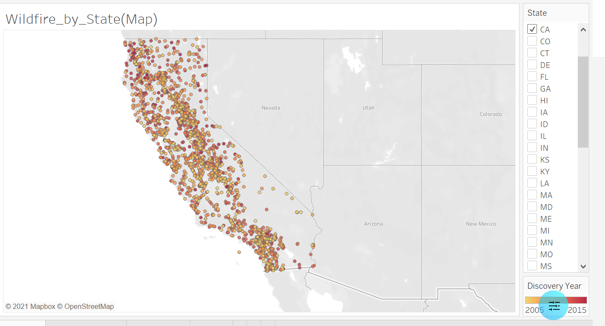
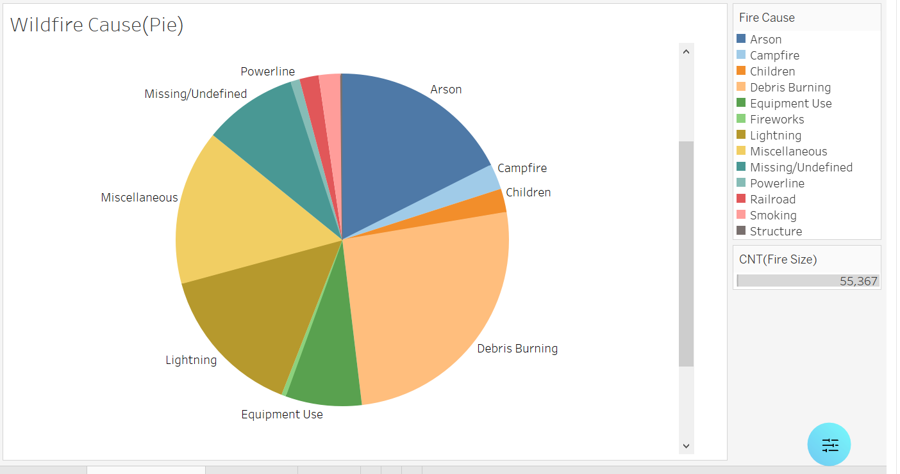

# project_one
group project

​
## Tableau

1. Wildfire_by_State(Map)

Website link :
https://public.tableau.com/views/wildfire_test/Wildfire_by_StateMap?:language=en-US&:display_count=n&:origin=viz_share_link

Embed Code:

<noscript></noscript><object class='tableauViz'  style='display:none;'><param name='host_url' value='https%3A%2F%2Fpublic.tableau.com%2F' /> <param name='embed_code_version' value='3' /> <param name='site_root' value='' /><param name='name' value='wildfire_test&#47;Wildfire_by_StateMap' /><param name='tabs' value='no' /><param name='toolbar' value='yes' /><param name='static_image' value='https:&#47;&#47;public.tableau.com&#47;static&#47;images&#47;wi&#47;wildfire_test&#47;Wildfire_by_StateMap&#47;1.png' /> <param name='animate_transition' value='yes' /><param name='display_static_image' value='yes' /><param name='display_spinner' value='yes' /><param name='display_overlay' value='yes' /><param name='display_count' value='yes' /><param name='language' value='en-US' /></object>
                

Screenshot:

2. Wildfire_Cause(Pie).PNG

Website link :
https://public.tableau.com/views/wildfire_test/WildfireCausePie?:language=en-US&:display_count=n&:origin=viz_share_link

Embed Code:

<noscript></noscript><object class='tableauViz'  style='display:none;'><param name='host_url' value='https%3A%2F%2Fpublic.tableau.com%2F' /> <param name='embed_code_version' value='3' /> <param name='site_root' value='' /><param name='name' value='wildfire_test&#47;WildfireCausePie' /><param name='tabs' value='no' /><param name='toolbar' value='yes' /><param name='static_image' value='https:&#47;&#47;public.tableau.com&#47;static&#47;images&#47;wi&#47;wildfire_test&#47;WildfireCausePie&#47;1.png' /> <param name='animate_transition' value='yes' /><param name='display_static_image' value='yes' /><param name='display_spinner' value='yes' /><param name='display_overlay' value='yes' /><param name='display_count' value='yes' /><param name='language' value='en-US' /></object>
                

Screenshot:

